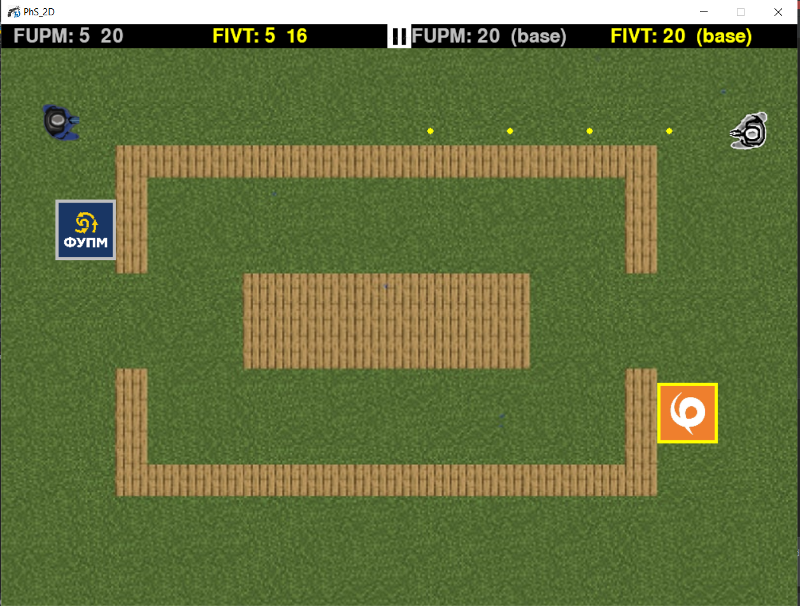
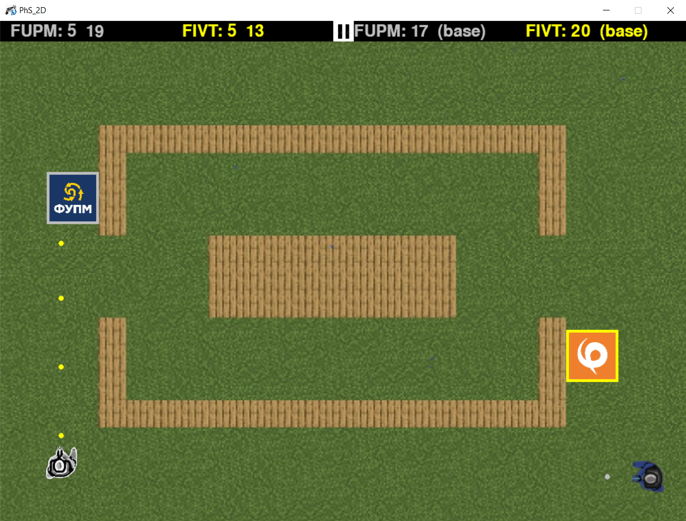
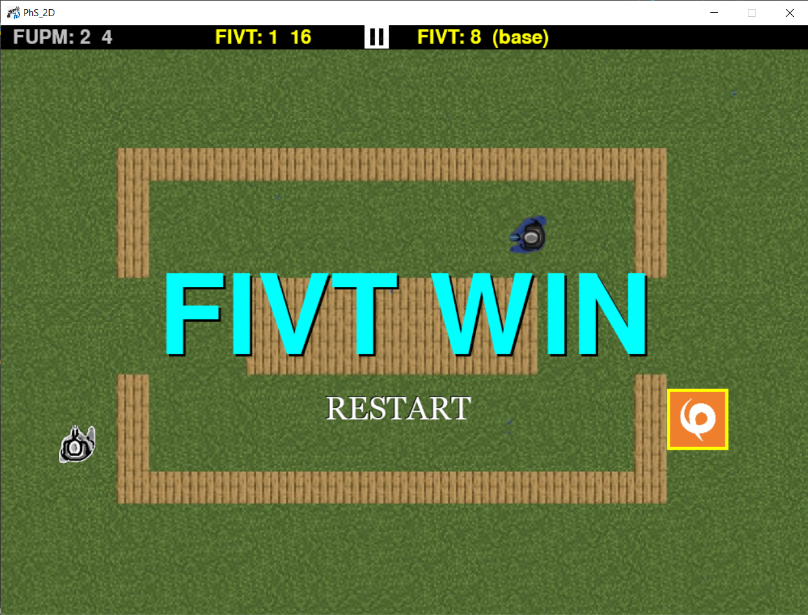

# Phystech Strike 2D


Phystech Strike 2D (PhS_2D) - a shooter game written in Python.
It is played by two players, orange (FIVT) and blue (FUPM) with
their military bases, respectively.  
Soldiers and bases have 5 and 20 heart powers (hp), respectively
and in each hit of a bullet, hp will decrease by one, if hp is 0,
that player will die.
The one who kills another soldier or destroys another base wins.
In addition, they have 20 bullets in their cartridges. Then after
reloading they can shoot.

 ### How to play?

+ **To clone files from github:**
```bash
git clone https://github.com/amonulloh/myFirstGame/tree/checkpoint_3
```
+ **Run main.py**
 ```bash
 python3 main.py
 ```

After running, the main menu window opens. There are 4 buttons in the main menu:
Play, Restart, Exit and sound.
+ Play - to start or continue the game;
+ Restart - to restart the game;
+ Exit - to exit;
+ Sound - to turn on / off the sound of the game;

Keys to play for the fupm / fivt player:
+ esc - for pause the game
+ w / up - moving up
+ s / down - moving down
+ a / left- moving left
+ d / right - moving right
+ Space / Enter - shooting

### Some screenshots from game:

=======
The beginning of the program.


Playing time.


Shooting players.


Game over. FIVT win

>>>>>>> 25dfe1b49429790d458b400e696047d876f9447d

The beginning of the program.


Playing time.


Shooting players.


Game over. FIVT win

***Thank you very much, Regards Manuel***
